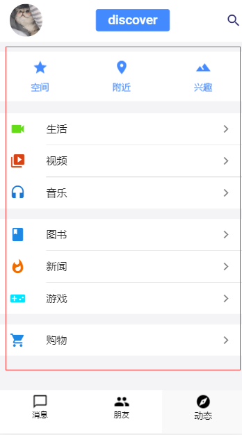

# 仿腾讯QQ

> 用Vue.js构建的简易QQ

## Build Setup

``` bash
# install dependencies
npm install

# serve with hot reload at localhost:8080
npm run dev

# build for production with minification
npm run build

# build for production and view the bundle analyzer report
npm run build --report

# run unit tests
npm run unit

# run e2e tests
npm run e2e

# run all tests
npm test
```

For a detailed explanation on how things work, check out the [guide](http://vuejs-templates.github.io/webpack/) and [docs for vue-loader](http://vuejs.github.io/vue-loader).

## 项目预备知识

> 1. Vue.js基础知识（Vue.js实战[梁灏]、官方文档[https://cn.vuejs.org/v2/guide/）](https://cn.vuejs.org/v2/guide/%EF%BC%89)
> 2. 熟悉Vue cli的使用
> 3. JavaScript、ES6（JavaScript高级程序设计第三版、ES6标准入门[阮一峰]）
> 4. stylus基础知识：https://stylus.bootcss.com/
> 5. 异步axios请求数据：http://www.axios-js.com/
> 6. MUSE UI用户交互界面（读者们可以换，这套UI用的人太少）：https://muse-ui.org/#/zh-CN
> 7. VueX：https://vuex.vuejs.org/

## 项目包准备

> 1. MUSE UI：
>
>    ```javascript
>    cnpm i muse-ui -S
>    
>    //然后在main.js中添加
>    import MuseUI from 'muse-ui';
>    import 'muse-ui/dist/muse-ui.css';
>    Vue.use(MuseUI);
>    ```
>
> 2. Axios:
>
>    ```javascript
>    cnpm i axios -S
>    
>    //用的时候直接引入
>    import axios from 'axios'
>    ```
>
> 3. Vuex:
>
>    ```javascript
>    cnpm i vuex -S
>    ```
>
> 4. 

## 项目结构

> 左图是整个项目的目录，右图是项目中src的目录
>
> 

## 项目路由

> src/router/index
>
>  

## 项目组件

#### 子组件

> src/components/topnav（头部组件）
>
>  

> src/components/sidbar（侧边弹出组件）
>
>  

> src/components/search（头部搜索组件）
>
>  
>
>  

> src/components/personindex（个人信息展示组件，**点击红框中的标签可以切换哦**）
>
>  

> src/components/bottomtab（底部导航栏）
>
>  

> src/components/dialog（聊天组件，**这里将它分为两个组件，一个是负责聊天信息的只是，另一个是负责其余界面的展示**）
>
>  

#### 入口组件

> src/components/message、src/components/fridneds以及src/components/discover
>
> 

## 后台数据交互

> 1. 用户基本信息
>
>    **在/static/mockdata.json中**
>
> 2. 用户聊天
>
>    **这个要注意，我们在这里用的是图灵机器人http://www.tuling123.com/，需要你去注册一个，然后去API文档中招对应API，如下：**
>
>     
>
>    **可以看到跨域了！！！！！**
>
>     
>
>    **这时候就要用到proxy代理了，打开config/index.js在proxyTable中加上如下内容  <font color="red">注：这个只有在生产环境有用哦</font>**
>
>     
>
>    **这时候当我们用axios请求/api/v2（也就是localhost:8081/api/v2，<font color="red">8081是我项目的端口</font>）时候，他就会自动转变成http://openapi.tuling123.com/openapi/api/v2**
>
>     